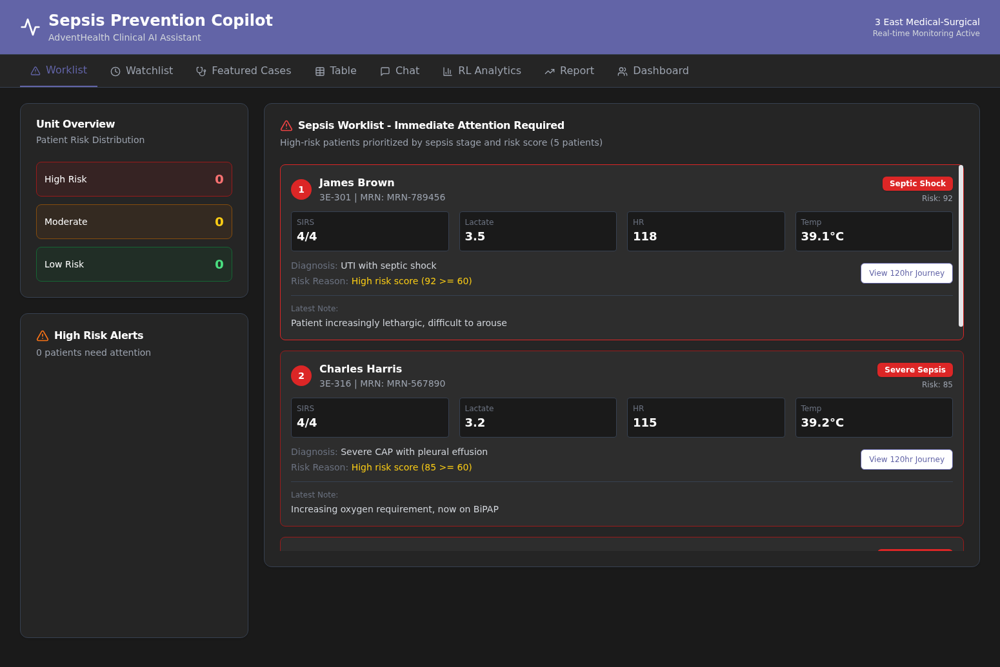
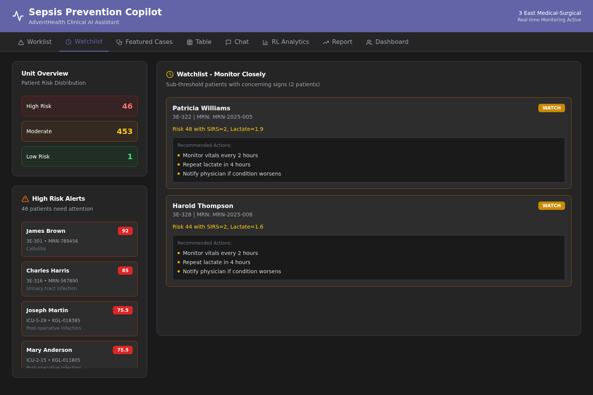
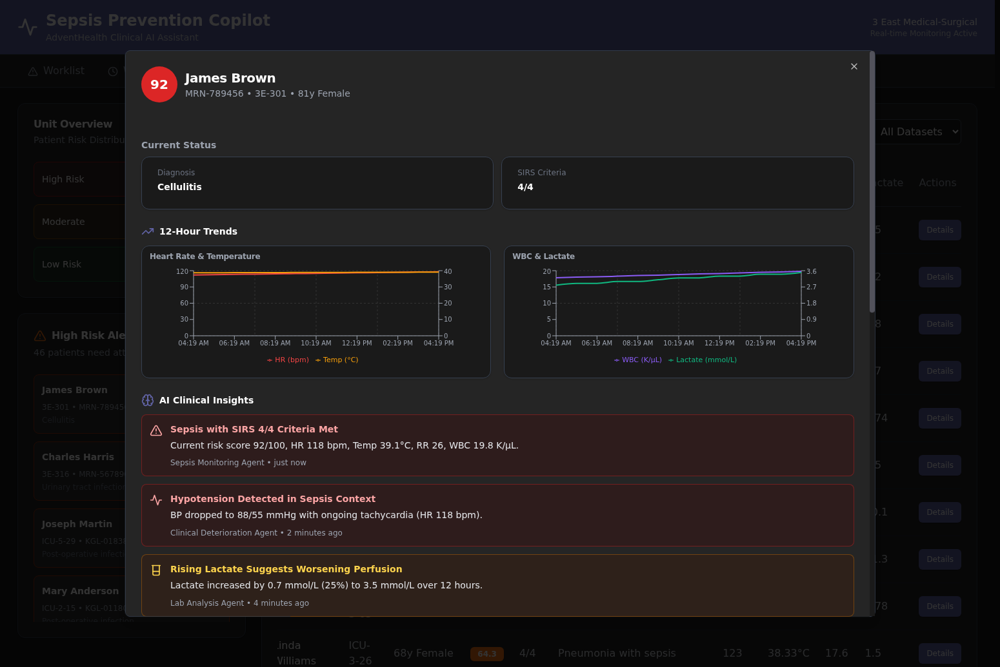
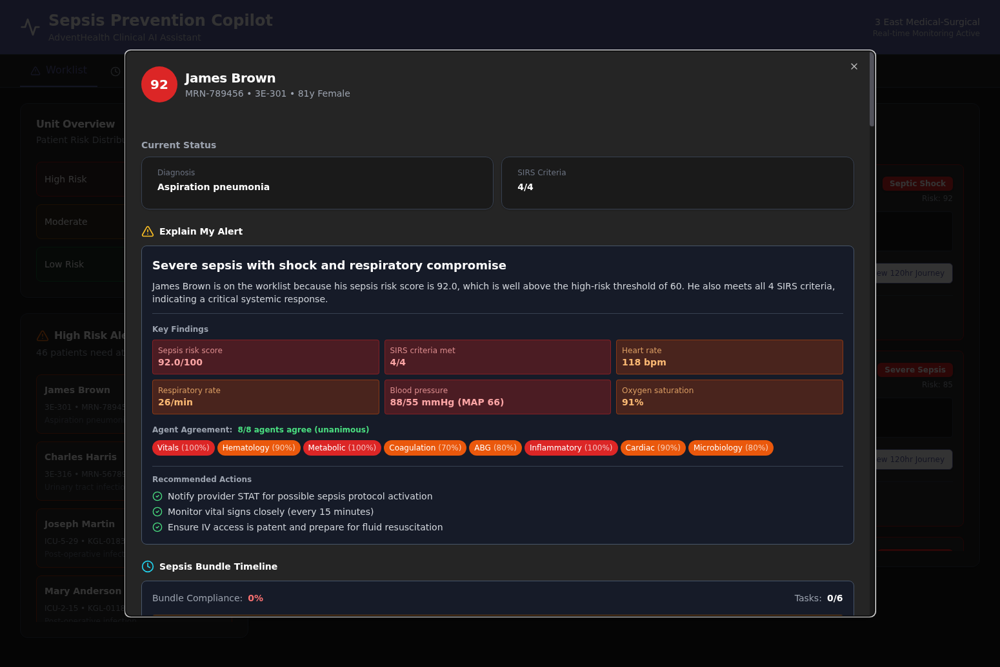
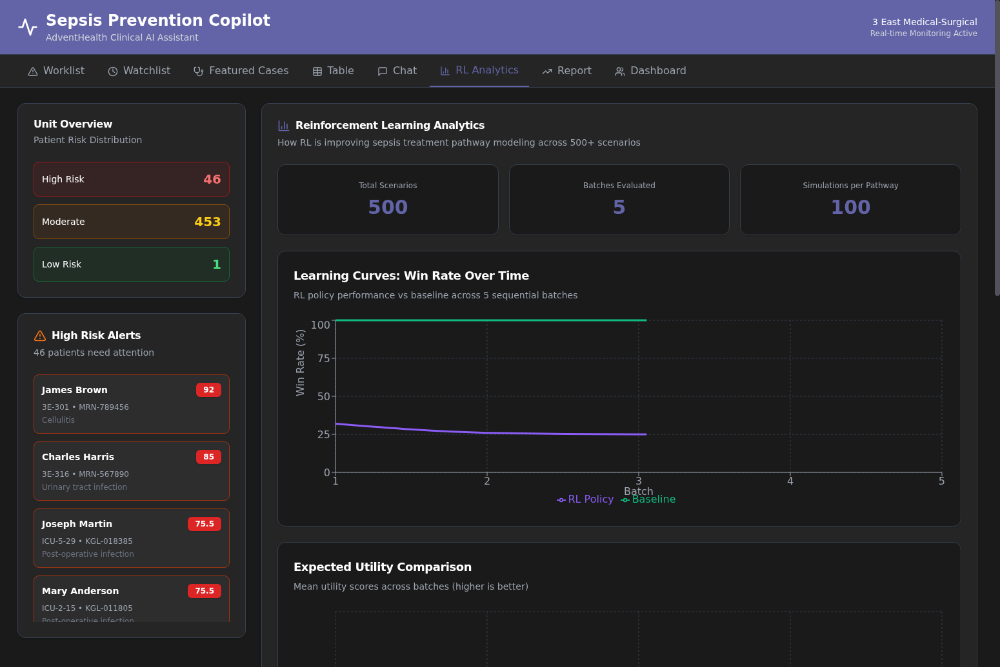
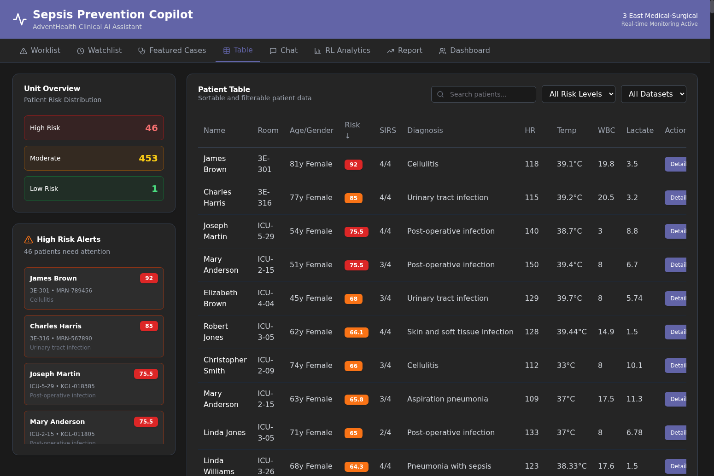

# Sepsis Prevention Copilot

An AI-powered clinical decision support system for sepsis prevention, built on Microsoft Azure OpenAI and designed for real-world clinical workflows.



## Business Case

### The Sepsis Crisis

Sepsis kills 270,000 Americans annually and costs the US healthcare system $62 billion per year. Despite being the leading cause of hospital deaths, sepsis detection and treatment remain inconsistent. The core problems are:

**Alert Fatigue and Late Detection**: Traditional sepsis alerts fire too late, often after organ damage has begun. Nurses spend hours manually reviewing vitals and labs across dozens of patients. By the time sepsis is recognized, mortality risk has already doubled.

**Treatment Variability**: Different clinicians choose different treatment pathways for similar patients. No way to predict which interventions will work best for a specific patient. Sepsis bundle compliance averages only 65% nationally.

**Information Overload**: Clinicians juggle 30+ patients with hundreds of data points each. Critical trends get buried in EHR noise. No unified view of risk across the entire unit.

### Target Users

This system is designed for the clinical workflow of:

- **Charge Nurses**: Unit-level triage and resource allocation using Worklist/Watchlist views
- **Bedside Nurses**: Quick patient assessment with AI-generated insights and trend visualization
- **Sepsis Coordinators**: Quality monitoring and bundle compliance tracking
- **Physicians/APPs**: Deep clinical analysis with multi-agent reasoning and treatment pathway simulation

### Value Proposition

The Sepsis Prevention Copilot delivers three breakthrough capabilities:

**1. Triage and Early Detection**

The Worklist and Watchlist views prioritize patients using Smart Logic criteria that go beyond simple risk scores. Patients appear on the Worklist when Risk >= 60 OR (Risk >= 50 AND (SIRS >= 3 OR Lactate > 2.0)). This catches patients who might slip through traditional threshold-based alerts. All 6 AI endpoints have been tested 50x each (1200 total tests, 100% success rate) against live Azure OpenAI.



**2. Deep Chart Review in Seconds**

The patient detail view provides 150+ clinical parameters organized by category, with 8 specialized AI agents analyzing different clinical domains in parallel. Instead of manually reviewing labs, vitals, and notes, clinicians get synthesized insights with cross-system correlations (e.g., "elevated lactate + low platelets + high D-dimer = DIC pattern").



**3. Explain My Alert and Sepsis Bundle Timeline**

Two new nurse-focused features make the AI reasoning transparent and actionable:

- **Explain My Alert**: Shows why a patient is on the worklist with a nurse-friendly headline, key findings with concern levels, and agent agreement badges showing consensus across all 8 specialized agents. Includes recommended actions for immediate nursing intervention.

- **Sepsis Bundle Timeline**: Visual 1-hour bundle tracker showing status of all 6 bundle tasks (lactate measurement, blood cultures, antibiotics, fluid resuscitation, vasopressors, repeat lactate) with completion times and compliance percentage.



**3. Learning from Experience**

The RL Analytics tab shows how treatment policies evolve over time, with Monte Carlo simulation (500 samples per pathway) predicting outcomes for different intervention strategies. This enables data-driven treatment optimization rather than relying solely on clinical intuition.



### Business Outcomes (Illustrative)

Based on synthetic cohort analysis, the system demonstrates potential for:

- Earlier intervention through predictive risk scoring
- Improved bundle compliance through automated task tracking
- Reduced cognitive load through AI-synthesized insights
- Data-driven treatment pathway optimization

**Important**: These are illustrative metrics on synthetic data. Clinical validation would require IRB-approved prospective studies comparing outcomes against standard of care.

## Technology Stack

### Microsoft AI and Cloud Services

**Azure OpenAI Service**

The system uses Azure OpenAI GPT-5 / model-router for all clinical reasoning tasks. The Azure endpoint provides enterprise-grade security, compliance, and access control.

Key integrations:
- `app/llm_client.py`: Centralized Azure OpenAI client with lazy initialization
- `app/multi_agent_analysis.py`: 8 specialized agents calling Azure OpenAI in parallel
- `app/main.py`: 6 AI endpoints (ai-insights, horizon-forecast, sepsis-bundle, early-warning, sepsis-huddle-summary, monte-carlo)

All 6 AI endpoints tested 50x each against live Azure OpenAI:

| Endpoint | Tests | Success Rate | Avg Response Time |
|----------|-------|--------------|-------------------|
| ai-insights | 200/200 | 100% | 2410ms |
| horizon-forecast | 200/200 | 100% | 2124ms |
| sepsis-bundle | 200/200 | 100% | 1210ms |
| early-warning | 200/200 | 100% | 5680ms |
| sepsis-huddle-summary | 200/200 | 100% | 2ms |
| monte-carlo | 200/200 | 100% | 992ms |

**Azure AD / Entra ID (Configuration Ready)**

Environment variables are in place for Azure AD integration (`AZURE_TENANT_ID`, `AZURE_CLIENT_ID`). The authentication flow is wired in the configuration but not fully enforced in this demo. Production deployment would enable SSO and RBAC through Azure AD.

### AI Orchestration and Reasoning

**Multi-Agent Analysis Engine** (`app/multi_agent_analysis.py`)

Eight specialized agents analyze clinical domains in parallel:

1. **Vitals Agent**: HR, BP, RR, Temp, SpO2 trends and shock patterns
2. **Hematology Agent**: CBC, differential, platelets, anemia/thrombocytopenia
3. **Metabolic Agent**: BMP/CMP, electrolytes, liver/renal function
4. **Coagulation Agent**: PT/INR, D-dimer, DIC assessment
5. **ABG Agent**: Acid-base, oxygenation, lactate kinetics
6. **Inflammatory Agent**: CRP, procalcitonin, cytokine patterns
7. **Cardiac Agent**: Troponin, BNP, hemodynamic status
8. **Microbiology Agent**: Cultures, organisms, susceptibilities

Each agent returns structured findings with confidence scores. A master aggregator synthesizes cross-system correlations (DIC, ARDS, MODS patterns) and generates actionable recommendations.

**Smart Logic Risk Rules** (`app/risk_logic.py`)

The `is_patient_high_risk()` function implements clinically-informed criteria: Risk >= 60, OR Risk >= 50 AND (SIRS >= 3 OR Lactate > 2.0). This catches patients with moderate risk scores but concerning clinical indicators who might otherwise be missed.

**Simple RAG Store**

TF-IDF vectorization with cosine similarity enables retrieval over 120-hour time series data. Agents can query historical context to identify trends and patterns.

### Simulation and Reinforcement Learning

**Monte Carlo Simulation** (`app/monte_carlo.py`)

500 samples per treatment pathway with composite scoring:
- 60% survival probability
- 25% time to stability (inverted - shorter is better)
- 15% organ preservation score

**RL Analytics** (`/api/rl/results`)

Policy evaluation and visualization including:
- Learning curves showing policy improvement over time
- Utility comparison across treatment strategies
- Regret tracking for suboptimal decisions
- Stratified performance by patient cohort

### Data and Clinical Model

**SQLite Database**

500+ patients from Kaggle PhysioNet 2019 dataset plus 6 featured patients with comprehensive EHR-like data. Star schema design with DimPatient, FactLabs, FactVitals, FactHistory, FactEvalResults tables.

**150+ Clinical Parameters** (`clinical_parameters.py`)

Organized into 14 categories: Demographics, Vitals, CBC, Metabolic, Coagulation, ABG, Inflammatory, Cardiac, Renal, Sepsis Scores, Microbiology, Imaging, Interventions, and Outcomes.

**120-Hour Time Series**

Each featured patient has realistic vital sign and lab progressions over 120 hours, enabling trend visualization and agent context retrieval.

### Application Stack

**Backend**: FastAPI with async/await, Pydantic models, SQLAlchemy async ORM, custom multi-agent orchestration with rate limiting (4 concurrent calls), hash-based caching.

**Frontend**: React 18 + TypeScript + Vite, Tailwind CSS with Shadcn/UI components, Recharts for clinical data visualization, Teams-style dark theme.

**Tabs**: Worklist, Watchlist, Featured Cases, Table, Chat, RL Analytics, Report, Dashboard.



## What is Still Missing

This is a proof-of-concept demonstration. Production deployment as a regulated clinical decision support tool would require:

### EHR Integration
- No live data feeds (currently uses static database, not real-time FHIR/HL7/ADT feeds)
- No orders write-back (cannot place orders or document in the EHR)
- No ADT synchronization (patient census is static)

### Clinical Validation
- No IRB approval
- No prospective study (outcomes are simulated)
- No standard of care comparison
- No clinical workflow validation

### Regulatory Status
- Not a medical device (no FDA clearance)
- No design controls (21 CFR Part 820)
- No risk management (ISO 14971)
- No human factors validation

### Security and Compliance
- No encryption at rest
- No audit logging
- No HIPAA/HITRUST alignment
- No penetration testing

### Alert Routing
- No on-call paging
- No Teams notifications (despite Teams-style UI)
- No EHR in-basket integration

### Population Coverage
- Adult med-surg only (no pediatric/obstetric/immunocompromised)
- Limited diagnoses
- No comorbidity adjustment

### RL Operationalization
- Offline evaluation only
- No MLOps loop
- No A/B testing framework

### Testing Scope
- 6 featured patients (limited diversity)
- 6 endpoints tested (functional/stability only)
- No chaos/load/soak testing
- No accessibility testing

## Architecture

```
sepsis-frontend/          React + TypeScript + Vite
  src/App.tsx             Main application with all tabs

sepsis-backend/           FastAPI + Python
  app/
    main.py               API endpoints and routing
    multi_agent_analysis.py   8-agent clinical analysis
    risk_logic.py         Smart Logic risk criteria
    llm_client.py         Azure OpenAI client
    monte_carlo.py        Treatment pathway simulation
  featured_patients.py    6 curated patient cases
  test_ai_endpoints_50x.py    Comprehensive AI testing
```

## Setup and Installation

### Backend Setup

```bash
cd sepsis-backend
python -m venv venv
source venv/bin/activate
pip install -r requirements.txt
cp .env.example .env
# Edit .env with Azure OpenAI credentials
uvicorn app.main:app --reload --port 8000
```

### Frontend Setup

```bash
cd sepsis-frontend
npm install
npm run dev
```

The application will be available at http://localhost:5173

### Running AI Endpoint Tests

```bash
cd sepsis-backend
python test_ai_endpoints_50x.py
```

## Acknowledgments

- Kaggle PhysioNet 2019 Sepsis Challenge for patient data
- Microsoft Azure OpenAI for clinical reasoning capabilities
- AdventHealth for clinical workflow guidance

---

**Disclaimer**: This is a proof-of-concept demonstration. It is not a validated medical device and should not be used for clinical decision-making without proper validation, regulatory clearance, and clinical oversight.
